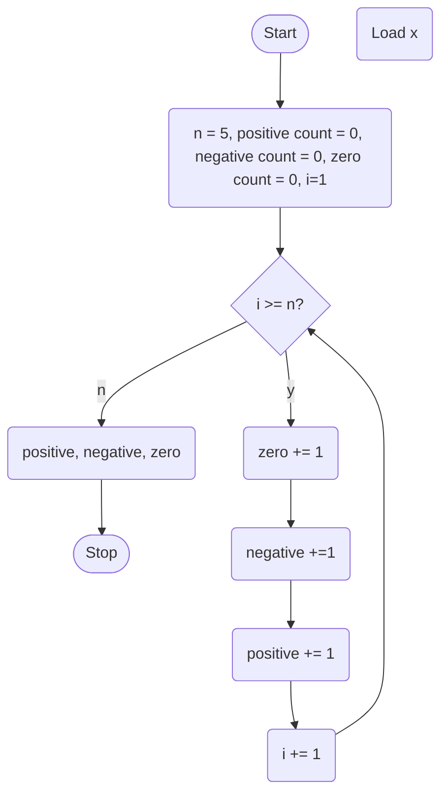

```mermaid
flowchart TD

    start(["Start"])
    stop(["Stop"])
    if{"i >= n?"}
    count1("i += 1")
    count2("positive += 1")
    count3("negative +=1")
    count4("zero += 1")
    input(Load x)
    Print(positive, negative, zero)

    init("n = 5, positive count = 0, negative count = 0, zero count = 0, i=1")


    start-->init-->if

    if--y-->count4-->count3-->count2-->count1-->if
    if--n-->Print-->stop


```