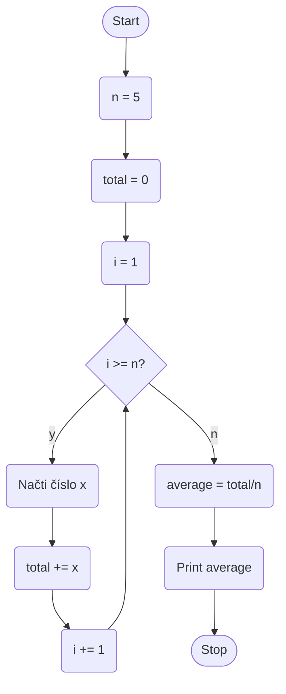

## Average value

```mermaid
flowchart TD
    Start(["Start"])
    init("n = 5")
    init2("total = 0")
    init4("i = 1")
    input("Načti číslo x")
    Pocitani("total += x")
    Pocitani2("i += 1")
    Pocitani3("average = total/n")
    Stop(["Stop"])
    if{"i >= n?"}
    Print-average("Print average")


    Start-->init-->init2-->init4

    init4--> if

    if --y-->input
    if --n-->Pocitani3-->Print-average-->Stop

    input-->Pocitani-->Pocitani2-->if
```